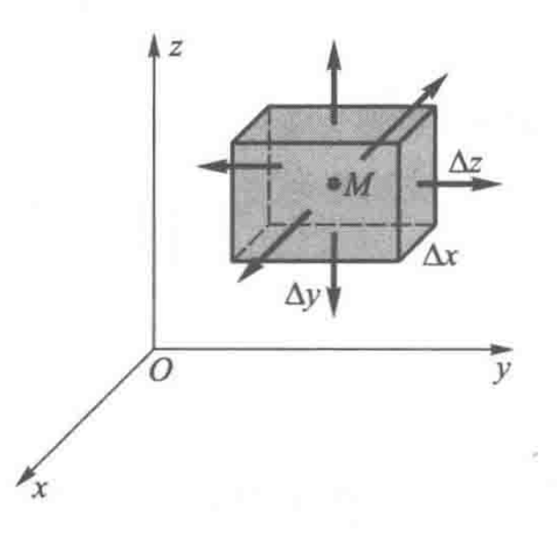

# 场论总概

## 0 场的定义

“场”：

描述某时刻某空间的物理量。由于物理量存在矢量和标量我们自然得出了“矢量场”和“标量场”。

标量场：

                                $$ u=u\left( x,y,z,t \right)  $$

$$ \text{也可记为：}u=u\left( \vec{r},t \right)  $$

矢量场：

            $$ \vec{F}=\vec{F}\left( x,y,z,t \right)  $$

$$ \text{也可记为：}\vec{F}=\vec{F}\left( \vec{r},t \right)  $$

在空间直角坐标系中我们常常记作：  
$$\vec{F}=P(x,y,z,t)\vec{i}+Q(x,y,z,t)\vec{j}+R(x,y,z,t)\vec{k}$$

我们往往注重讨论静态场，即${t\equiv C}$的情况。

$$\begin{cases}
 \text{标量场：}u=u(x,y,z)\\
 \text{矢量场：}\vec{F}=P\vec{i}+Q\vec{j}+R\vec{k}
\end{cases}$$

为了描述场的性质我们将会讨论1.方向导数&梯度2.通量&散度3.环流&旋度。

## 1 标量场的方向导数和梯度

### 1-1方向导数

**方向导数用于描述标量场沿任意方向的变化规律**

这里我们以二元函数为例子，二元函数可以增加Z轴（高度来直观表示），三元函数不好在三维空间表示。

**现在请你想象在一个具有曲率的曲面上行走，朝着任意方向（方向矢量）行走，海拔的变化高度，这似乎就等于你分别朝着$x$方向和$y$方向行走二差生的高度之和**
$$ \left. \frac{\partial f}{\partial l} \right|_{\left( x_0,y_0 \right)}\xlongequal{def}\lim_{\Delta l\rightarrow 0}\frac{u\left( x+\Delta l\cos \theta ,y+\Delta l\cos \beta \right) -u\left( x,y \right)}{\Delta l} $$ $$ =\frac{\partial u}{\partial x}\cos \theta +\frac{\partial u}{\partial y}\cos \beta =\left( \nabla u \right) \cdot \vec{e}_l $$
给出直观的几何图形：

Proof：

$$
\frac{\partial u}{\partial l}
=\frac{dz}{dl}=\frac{dz_x+dz_y}{dl}
=\frac{\frac{\partial u}{\partial x}dx+\frac{\partial u}{\partial y}dy}{dl}
=\frac{\partial u}{\partial x}\frac{d x}{d l}+\frac{\partial u}{\partial x}\frac{d y}{d l}
=\frac{\partial u}{\partial x}\cos\theta+\frac{\partial u}{\partial y}\cos\beta
$$

核心：增量可以使用全微分来表示，然后每个方向上的全微分分量除以$dl$分别得$\vec{l}$与每个坐标轴的夹角。
公式显然可以推广至更高维度
### 1-2 梯度

**我们想知道方向导数沿什么方向最大，并且最大是多少？**
这显然是一个矢量问题，我们暂且给出定义稍后给出证明。
$$\text{grad}u\xlongequal{def}\frac{\partial u}{\partial x}\vec{i}+\frac{\partial u}{\partial y}\vec{j}+\frac{\partial u}{\partial z}\vec{k}$$
我们想知道什么方向最大，这显然是一个求最值的问题，即求下式最值问题：
$$\frac{\partial u}{\partial l}=\frac{\partial u}{\partial x}\cos \theta+\frac{\partial u}{\partial y}\cos \beta+\frac{\partial u}{\partial z}\cos \gamma$$
由于需要求一个方向，我们需要在这个式子中分出一个方向的量，根据观察可以发现这种线性结构似乎可以表达成两个向量的内积：
$$(\frac{\partial u}{\partial x},\frac{\partial u}{\partial y},\frac{\partial u}{\partial z})(\cos \theta,\cos \beta,\cos \gamma)=(\nabla u)\cdot \vec{e_l}=|\nabla u|\cdot|\vec{e_l}|\cos(\nabla u,\vec{e_l})=|\nabla u|\cos(\nabla u,\vec{e_l})$$
某定点处$|\nabla u|$是一个定值，所以此时的最大值就是当且仅当$\nabla u$和$\vec{e_l}$同向的时候，即：$\cos(\nabla u,\vec{e_l})=1$，因而我们确定了**方向**：$\vec{e_l}$同向,确定了**大小**：$|\nabla u|$
所以最终的梯度定义为了：$$\text{grad}u\xlongequal{def}\frac{\partial u}{\partial x}\vec{i}+\frac{\partial u}{\partial y}\vec{j}+\frac{\partial u}{\partial z}\vec{k}=\nabla u$$

## 2 矢量场的通量和散度

### 2-1 矢量场的通量

**描述矢量场中空间某处通过一个面的量**

$$\varPhi=\iint\limits_{S}\vec{F}\cdot\mathrm{d}\vec{S}$$
在三维直角坐标系中：
$$\underset{\Sigma}{\iint}\vec{F}\cdot d\vec{S}=\underset{\Sigma}{\iint}P(x,y,z)dydz+Q(x,y,z)dxdz+R(x,y,z)dxdy$$
我们只取$x$方向就是：
$$\underset{D_{xy}}{\iint}P(x,y,z)dxdy$$
### 2-2 矢量场的散度
**用于描述通量对体积的变化率，即单位体积内穿出的通量，反映了“源的强度”**
我们定义散度：
$$\text{div}F=\lim_{\Omega\to M}\frac{\iint\limits_{S}\vec{F}\cdot\mathrm{d}\vec{S}}{V}$$
$\Omega\to M$表示体积无限压缩与一点M，即：$\Delta V \to 0$
在三维直角坐标系中有如下计算公式：
$$\text{div}F=\frac{\partial P}{\partial x}+\frac{\partial Q}{\partial y}+\frac{\partial R}{\partial z}$$
Proof:
三维直角坐标系中我们有三个方向，对于闭合曲面将会穿过六个面。
**需要说明的是，我们仅仅关注闭合曲面所围成空间内的“源”或“汇”产生的矢量，因为位于外部的源对闭合曲面的通量贡献率总为0，所以我们能确定正负性问题。**

---
不严谨的证明：
我们只考虑$x$方向，该方向有两个面$S_1,S_2$：
通过$S_1$面的通量：$\varPhi_{S_1}=A_x\cdot dydz$
通过$S_2$面的通量：$\varPhi_{S_2}=-(A_x + \Delta A_x)\cdot dydz$
则通过$x$方向的总通量：$\varPhi_x=\varPhi_{S_1}+\varPhi_{S_2} = \Delta A_x\cdot dydz$
同理我们获得了三维坐标系的总通量：

$$
\begin{align*}
\varPhi &= \varPhi_x + \varPhi_y + \varPhi_z \\
&= \Delta A_x \cdot dydz + \Delta A_y \cdot dxdz + \Delta A_z \cdot dxdy
\end{align*}
$$

使用微分近似原理$\Delta A_x={A_x}^{'}dx$

$$
\begin{align*}
\varPhi &= \varPhi_x + \varPhi_y + \varPhi_z \\
&= {A_x}^{'} dx \, dy \, dz + {A_y}^{'} dy \, dx \, dz + {A_z}^{'} dz \, dx \, dy
\end{align*}
$$

综上所述我们得到散度的计算公式
$$
\begin{align*}
\text{div}\vec{A} &= \frac{\Delta A}{\Delta V} \\
&= \frac{{A_x}^{'} dx \, dy \, dz + {A_y}^{'} dy \, dx \, dz + {A_z}^{'} dz \, dx \, dy}{dxdydz} \\
&= {A_x}^{'} + {A_y}^{'} + {A_z}^{'}
\end{align*}
$$

---
下面是严谨证明：

$$\varPhi=[\underset{\text{上}}{\iint} + \underset{\text{下}}{\iint} + \underset{\text{左}}{\iint} + \underset{\text{右}}{\iint} + \underset{\text{前}}{\iint} + \underset{\text{后}}{\iint}]\vec{F}\cdot d \vec{S}$$
我们暂且只取$x$方向进行研究：
$$\underset{\text{前}}{\iint}\vec{F}\cdot d\vec{S}\approx P(x+\Delta x/2,y,z)\Delta y\Delta z$$
$$\underset{\text{后}}{\iint}\vec{F}\cdot d\vec{S}\approx -P(x-\Delta x/2,y,z)\Delta y\Delta z$$
由泰勒展开
$$\begin{aligned}
F_{x}\Bigg(x+\frac{\Delta x}{2},y,z\Bigg)& =P(x,y,z)+\frac{\partial P(x,y,z)}{\partial x}\frac{\Delta x}{2}+\frac{1}{2}\frac{\partial^{2}P(x,y,z)}{\partial x^{^2}}\Bigg(\frac{\Delta x}{2}\Bigg)^{^2}+\cdots   \\
&\approx P(x,y,z)+\frac{\partial F_x(x,y,z)}{\partial x}\frac{\Delta x}2
\end{aligned}$$
进而得到：
$$\underset{\text{前}}{\iint}\vec{F}\cdot d\vec{S}\approx P(x,y,z)\Delta y\Delta z+\frac{\partial P(x,y,z)}{\partial x}\frac{\Delta x\Delta y\Delta z}{2}$$
$$\underset{\text{后}}{\iint}\vec{F}\cdot d\vec{S}\approx -P(x,y,z)\Delta y\Delta z+\frac{\partial P(x,y,z)}{\partial x}\frac{\Delta x\Delta y\Delta z}{2}$$
综上沿着$x$方向：
$$[\underset{\text{前}}{\iint}+\underset{\text{后}}{\iint}] \vec{F}\cdot d\vec{S}\approx \frac{\partial P(x,y,z)}{\partial x}\Delta x\Delta y\Delta z$$
我们将$x,y,z$全部求和得到：

$$\oiint\limits_{S}\vec{F}\cdot\mathrm{d}\vec{S}\approx\left(\frac{\partial P}{\partial x}+\frac{\partial Q}{\partial y}+\frac{\partial R}{\partial z}\right)\Delta x\Delta y\Delta z$$
所以得到散度在直角坐标系计算公式：
$$\text{div}F=\lim_{\Delta V\to 0}\frac{\iint\limits_{S}\vec{F}\cdot\mathrm{d}\vec{S}}{\Delta V}=\frac{\partial P}{\partial x}+\frac{\partial Q}{\partial y}+\frac{\partial R}{\partial z}=\nabla\cdot \vec{F}$$

### 2-3 通量和散度的关系

**我们经常用高定理反应通量和散度的关系**
$$\underset{\Omega}{\oiiint}(\frac{\partial P}{\partial x}+\frac{\partial Q}{\partial y}+\frac{\partial R}{\partial z})dV=\underset{\Sigma}{\iint}Pdydz+Qdxdz+Rdxdy$$
简记为：
$$\underset{\Omega}{\iiint}\nabla \cdot \vec{F}dV = \underset{\Sigma}{\oiint}\vec{F}\cdot d\vec{S}$$
这个式子表明，**散度的三重体积分等于该闭合曲面的通量**
关于高斯定理的证明使用三重积分的计算方法转化为二重积分。

## 3 矢量场的环流与旋度  
