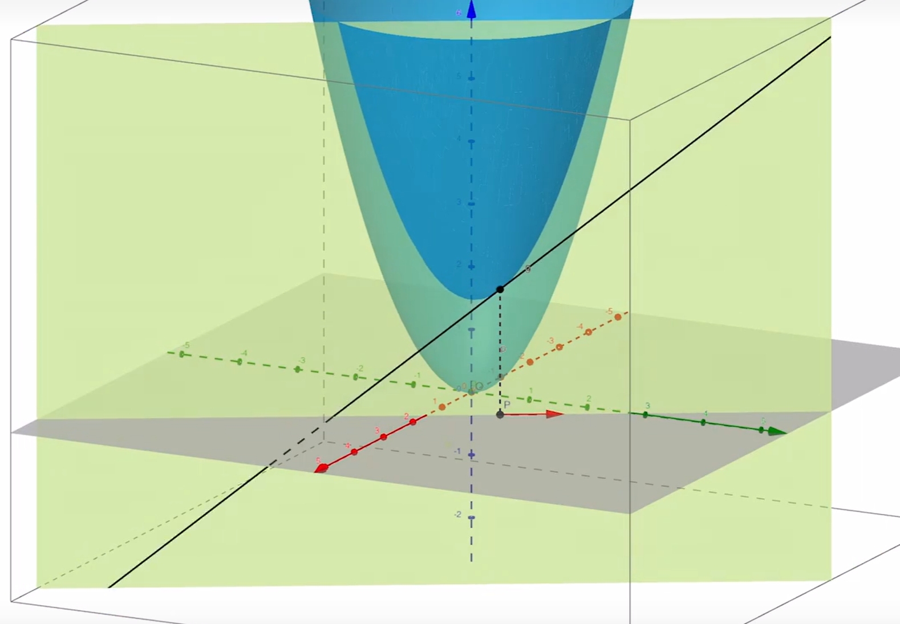

>【【多元微分专题】第六期：方向导数和梯度的直观理解】 <https://www.bilibili.com/video/BV1uZ4y1L7bB/?share_source=copy_web&vd_source=64424ee6fb245a51fdfb583af45a2606>

## 方向余弦

为了刻画方向，我们不妨取单位长度，方向余弦去刻画

## 方向导数的几何意义  

沿着方向余弦可以做一个面，该面与函数有一个截线，在该点的方向导数就是截线在该点的切线斜率，他显然是一个常数

## 方向导数的定义

## 方向导数的计算

1. $u=f(x,y)$，二元函数

对于二元函数，求某点$(x_0,y_0)$沿某方$l$的方向导数

$$\left.\frac{\partial f}{\partial l}\right|_{(x_0,y_0)}=f_x^{\prime}\left(x_0,y_0\right)\cos\alpha+f_y^{\prime}\left(x_0,y_0\right)\cos\beta $$
其中:$l$方向上单位向量是: $\overrightarrow{e_l}=(\cos\alpha,\cos\beta)\text{,}cos\alpha,cos\beta$是方向余弦

---

1. $u=f(x,y,z)$ 三元函数
对于二元函数，求某点$(x_0,y_0)$ 沿某方$l$的方向导数:
$$\left.\frac{\partial f}{\partial l}\right|_{(x_0,y_0,z_0)}=f_x^{\prime}\left(x_0,y_0,z_0\right)\cos\alpha+f_y^{\prime}\left(x_0,y_0,z_0\right)\cos\beta+f_z^{\prime}\left(x_0,y_0,z_0\right)\cos\gamma $$
其中:$l$方向上单位向量是: $\overrightarrow{e_l}=\left(\cos\alpha,\cos\beta,cos\gamma\right),cos\alpha,cos\beta,cos\gamma$是方向余弦。

## 计算公式推导
根据全微分的概念和几何关系我们给出不严谨的证明
![[Pasted image 20230917155157.png]]
三维空间的情况相同，这是标量场的方向导数，方向导数很好的解释了空间标量场中某一点，沿特定方向的变化率是多少，从而反应标量场的“陡峭”程度。